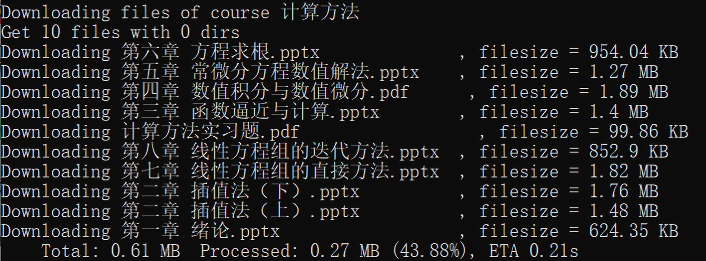

<p align="center">  </p>

<p align="center">

  
  	
  
  
  
  </br>
  
  
  
  
  

</p>

# 教学立方课件下载器

在线教学平台——[教学立方](https://teaching.applysquare.com)的课件批量下载脚本，基于**Python** + **Requests**

> 创建日期：2020-03-30  
> 更新日期：2021-09-21

## 下载地址

**更新日期：2020年6月21日**

推荐通过Github release[下载](https://github.com/EricZhu-42/PedagogySquare_Downloader/releases/download/v1.7/PedagogySquare_Downloader_20210621.zip)；若连接速度较慢，亦可通过国内镜像地址[下载](https://box.nju.edu.cn/f/4214a2459d4347df9394/?dl=1)。


## 版本更新日志

### 2021年6月21日：功能性更新

在 `config.json` 文件中增加了 `cid_include_list` 项，在非空时将仅下载指定的部分课程。

### 2021年4月26日：功能性更新

在 `config.json` 文件中增加了 `keep_dirs` 项，可选择下载时是否保持课件的文件夹结构（默认为 `false`）

### 2021年3月5日：功能性更新

为了方便课件管理，当前版本的 `config.json` 文件中增加了 `save_path` 项（支持绝对路径/相对路径），可设置下载文件的保存目录。

请参照下文“配置文件说明”一节，调整下载目录（默认为空，表示下载到脚本的相同目录）

### 2021年3月1日：Windows平台下的工具封装

**TLDR: 当前版本做了脚本封装，现在Windows平台下不安装Python环境也能用了**

自2021年3月1日起，我们将在release中为**Windows平台**用户提供封装后的**独立可执行程序**（standalone executable）。**无需安装配置Python环境即可使用封装后的课件下载工具**，具体的使用方法为：

1. 下载并解压最新的release文件包，并进入解压后的文件夹
3. 参照下文“最简配置方案”一节，修改文件 `config.json` ，填入用户名、密码等信息
4. 双击执行 `run.bat`，等待课件下载完成

此外，新版本脚本优化了 `config.json` 的配置逻辑，推荐参考下文“配置文件说明”一节重新进行配置。

> 如果更新后的脚本无法正常使用，请尝试回退至[旧版本](https://github.com/EricZhu-42/PedagogySquare_Downloader/releases/download/v1.4_stable/PedagogySquare_Downloader_20200914.zip)，观察问题是否解决，并联系开发者反馈问题，感谢！

## 程序特色

1. **一键下载**所有课程的全部课件，方便快捷
2. **可下载未直接开放下载的课件**，视频等内容
3. **可深度配置**的课程筛选/文件拓展名筛选功能

> 本程序旨在方便学生下载教学立方平台上的课件及相关教学资料，消除下载文件的重复劳动  
> 请尊重教师的知识产权与劳动成果。除非获得教师许可，请勿将下载得到的文件在互联网上进行传播  
> 如本程序损害了您的权益，请联系作者删除相关代码  

## 运行环境

开发过程中使用的环境与第三方模块版本如下：

- **Python** = 3.7.4

- **Requests** = 2.22.0

为了正常运行脚本，请安装**不低于**以上版本的Python与Requests

> 另：经测试，**该脚本可在移动端的终端模拟器中正常运行**；安卓平台执行Python脚本可以参考[@OrangeX4](https://github.com/OrangeX4)提供的[工具与教程](https://orangex.orangex4.cool/)。

## 使用方法

### 1. 配置环境（请参考其他教程）

1. 安装对应版本的Python

2. 安装对应版本的Python模块：**Requests**（推荐使用[Anaconda](https://www.anaconda.com/)进行管理）


### 2. 修改配置文件

修改文件 `config.json` ，填入用户名、密码等信息

> 关于如何修改配置文件，请参考“最简配置方案”一章  
> 关于配置文件内各项参数的说明，请参考“配置文件说明”一章  

### 3. 运行脚本

运行 `download.py`  

> 注：若运行过程中出现下载速度过慢等现象，可能是由于与教学立方网站连接不稳定，请尝试重新运行脚本。

## 项目结构介绍

| 文件名              | 功能                     |
| ------------------- | ------------------------ |
| figure/             | 脚本说明中用到的图片文件 |
| download.py         | 脚本运行入口             |
| config.json         | 执行参数的配置文件       |
| config_example.json | 供参考的样例配置文件     |

## 最简配置方案

```json
{
	"username": "your_username",
	"password": "your_password",
	"ext_expel_list": [],
	"cid_expel_list": [],
	"cid_include_list": [],
        "save_path": "",
	"keep_dirs": false
}
```

将 `your_username` 与 `your_password` （**注意保留外部的双引号**）替换成你的**手机号**和**教学立方登录密码**即可，其他参数无需修改。

> 请确保json文件格式正确，可参考提供的 `config_example.json` 进行配置。

## 配置文件说明

以下对 `config.json` 内各项参数进行简要说明：

| 参数名               | 类型 | 含义                                                |
| -------------------- | ---- | --------------------------------------------------- |
| username             | str  | 教学立方登录用户名（一般为手机号）                  |
| password             | str  | 教学立方登录密码                                    |
| ext_expel_list       | list | 排除文件的类型列表                                      |
| cid_expel_list             | list | 排除课程的课程ID列表                                    |
| cid_include_list | list | 保留课程的ID列表 |
| save_path | str | 下载目录（支持绝对路径或相对路径） |
| keep_dirs | bool | 是否保留文件的目录结构 |

### 注意事项与说明：

1. 例如：若不需要下载课程ID为 `12345` 的课程，且不需要下载 `pdf` 文件与 `mp4` 文件，可设置为：
   - `ext_expel_list = ["pdf", "mp4"]`
   - `cid_expel_list = [12345]`
2. 在修改下载目录 `save_path` 时，请先在对应的位置**创建文件夹**；如无法找到对应的文件夹，将会报错并在默认目录（程序根目录）保存下载得到的文件。
4. 课程ID在课程主页地址中查看，例如：  
     
   图中对应课程的ID为**8261**  


## 版权信息

联系邮箱：zhuxinhao00@gmail.com

本项目基于MIT协议开源
