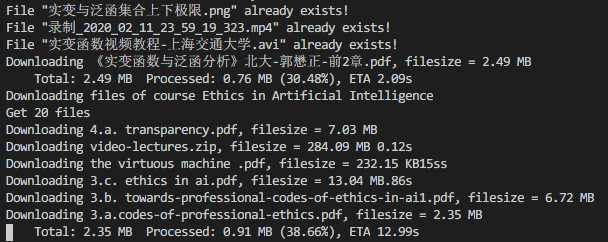
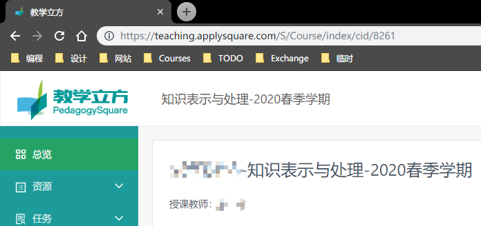

# 教学立方课件下载器

在线教学平台——[教学立方](teaching.applysquare.com)的课件批量下载脚本，基于**Python** + **ChromeDriver**

> 创建日期：2020-03-30  
> 更新日期：2020-03-31  

## 程序特色

1. **一键下载**所有课程的全部课件，方便快捷
2. **可下载未直接开放下载的课件**，视频等内容
3. **可深度配置**的课程筛选/文件拓展名筛选功能

以下为运行过程中控制台截图示例：



> 本程序旨在方便学生下载教学立方平台上的课件及相关教学资料，消除下载文件的重复劳动  
> 请尊重教师的知识产权与劳动成果。除非获得教师许可，请勿将下载得到的文件在互联网上进行传播  
> 如本程序损害了您的权益，请联系作者删除相关代码

## 开发环境

开发过程中使用的环境与第三方模块版本如下：

- **Python** = 3.7.4

- **Requests** = 2.22.0

- **Selenium** = 3.141.0

使用的浏览器与WebDriver为：

- **Chrome** = 75.0.3770.142，包含对应版本的ChromeDriver

> **理论上**该脚本**兼容**其他版本的Python环境（新的一般没问题，旧一点的应该也行），但请在发生错误时关注兼容性问题
>
> 该脚本针对Chrome + ChromeDriver开发，如使用其他Browser + WebDriver组合需要修改脚本中的WebDriver参数  
（更新：**Chromium Edge** + ChromeDriver **可以**正常使用该脚本）

## 使用方法

### 1. 配置环境（请参考其他教程）

1. 安装对应版本的Python

2. 安装对应版本的Python模块：Requests, Selenium（推荐使用[Anaconda](https://www.anaconda.com/)进行管理）

3. 安装Chrome，并下载Chrome[对应版本的WebDriver](https://chromedriver.chromium.org/downloads)

> 提供一种安装ChromeDriver的简单方法：根据自己的Chrome版本，在[镜像站点](http://npm.taobao.org/mirrors/chromedriver/)下载对应版本的ChromeDriver，**与脚本放在同一目录**即可。

### 2. 修改配置文件

修改文件 `config.json` ，填入用户名、密码等信息

> 关于如何修改配置文件，请参考”最简配置方案“一章  
> 关于配置文件内各项参数的说明，请参考”配置文件说明“一章  

### 3. 运行脚本

运行 `download.py` 

> 注：若运行过程中出现下载速度过慢等现象，可能是由于与教学立方网站连接不稳定，请尝试重新运行脚本。

## 项目结构介绍

| 文件名              | 功能                     |
| ------------------- | ------------------------ |
| figure/             | 脚本说明中用到的图片文件 |
| download.py         | 脚本运行入口             |
| config.json         | 执行参数的配置文件       |
| config_example.json | 供参考的样例配置文件     |

## 最简配置方案

```json
{
	"username": "your_username",
	"password": "your_password",
	"headless_mode": true,
	"download_all_ext": true,
	"download_all_courses": true,
	"ext_list": [],
	"ext_expel_list": [],
	"cid_list": []
}
```

将 `your_username` 与 `your_password` （**保留双引号**）替换成你的**手机号**和**教学立方登录密码**即可，其他参数无需修改。

> 请确保json文件格式正确，可参考提供的 `config_example.json` 进行配置。

## 配置文件说明

以下对 `config.json` 内各项参数进行简要说明：

| 参数名               | 类型 | 含义                                                |
| -------------------- | ---- | --------------------------------------------------- |
| username             | str  | 教学立方登录用户名（一般为手机号）                  |
| password             | str  | 教学立方登录密码                                    |
| headless_mode        | bool | 是否启用WebDriver的headless模式（运行时不显示界面） |
| download_all_ext     | bool | 是否下载所有类型的文件                              |
| download_all_courses | bool | 是否下载所有课程的课件                              |
| ext_list             | list | 下载文件的类型（如：pdf，docx，zip）                |
| ext_expel_list       | list | 排除文件的类型                                      |
| cid_list             | list | 需要下载的课程ID                                    |

#### 注意：

1. 文件类型参数优先级为：`ext_expel_list` > `download_all_ext` > `ext_list`  
   如：若希望下载“除了zip格式文件外的所有类型文件“，应设置参数为

   - `download_all_ext` = `true`
   - `ext_list` = `[zip]`

2. 课程ID在课程主页地址中查看，例如：  
     
   图中对应课程的ID为**8261**

## 版权信息

联系邮箱：zhuxinhao00@gmail.com

本项目基于MIT协议开源
